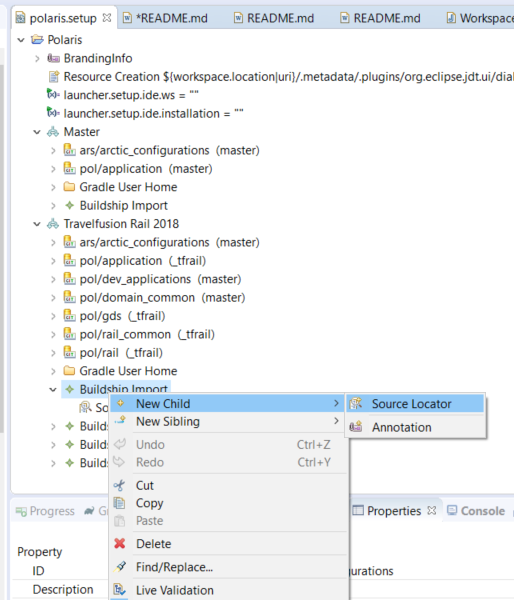

# Oomph Buildship import

Gradle project import task for setting up development environments using Eclipse Oomph.

This work is based on code from this older implementation: https://github.com/herkne/buildship-import-4-oomph


## Overview

This Eclipse plug-in leverages functionality of the [Eclipse Buildship plugin](https://projects.eclipse.org/projects/tools.buildship) to realize an [Oomph setup task](https://help.eclipse.org/mars/index.jsp?topic=%2Forg.eclipse.oomph.setup.doc%2Fhtml%2Fconcepts%2FDocTask.html).

It basically does Buildship´s "Existing Gradle Project" import. The parameters for that import are described as Oomph xml. The Oomph *Setup Editor* supports the configuration.

```xml
<setupTask xsi:type="buildshipimport:BuildshipImportTask"
           id="buildshipimport.arctic_master">
   <sourceLocator rootFolder="${installation.location/git/arctic_configurations}"/>
   <sourceLocator rootFolder="${installation.location/git/arctic}"/>
</setupTask>
```
TBC


### Original documentation

These plugins provide an oomph setup task to import gradle projects into eclipse using the buildship project-import wizard.

After the project has been successfully imported an optional gradle task may be executed. The task checks the presence of a file `.settings/gradle.prefs` in the project root directory. The task will be executed if either this file is missing or its contents points to another project location.

For the moment consider this to be in alpha state. The task seems to work with all of my setups i tried so far, but problems might still exist.

To build the project you need a workspace with both oomph and buildship installed (sorry, no setup file yet).
Import the projects into the workspace, use the genmodel file to generate the model and edit code, then export the feature.

Add the feature to the workspace you use to edit your setup files and to the workspace in which the task will be executed.

There is a p2 update site here: http://p2.kneissel.mail-und-web.de/update/buildshipimport


## Usage

with Oomph, Buildship and the plugin installed:

- open (Project) setup in Oomph setup editor
- select Node, open right-click open context menue
- as "New Child" select "Buildship import" to create node
- on new node use context menue to created one or more "New Child" "Source Locator"




### General properties

The task ~~provides~~ used to provide the following properties, work-in-progress:

| original name          | original docu                                                | change | implementation / priority |
| ---------------------- | ------------------------------------------------------------ | --------------- | ------------------------- |
| `ProjectRootDirectory` | set this to a file url pointing to the folder containing the gradle project to be imported. | using built-in *sourceLocator* | [x]                       |
| `JavaHome`             | set this to a file url to be passed on to the buildship import task as the JRE to be used. |                 | [ ] lowest                |
| `Arguments`            | defined but currently not used.                              |                 | [ ] lowest                |
| `JvmArguments`         | defined but currently not used.                              |                 | [ ] lowest                |
| `ImportWaitTime`       | if set to 0 the task creates and starts a job to import the project and then continues. If set to a positive number (the default is 30) the task waits these number of seconds for the import to complete before continuing. If the import does not complete in time this is considered as an error. |                 | [ ] low                   |

### Buildship plugin workspace settings override

| original property   | original docu                                                | change | implementation / priority |
| ------------------- | ------------------------------------------------------------ | --------------- | -------------- |
| `GradleUserHome`    | the file url to be passed on to the buildship import task as the gradle user home directory to be used. |                 | [ ] low        |
| `BuildScansEnabled` |                                                              |                 | [ ] lowest     |
| `OfflineMode`       |                                                              |                 | [ ] lowest     |
| `AutoSync`          |                                                              |                 | [ ] lowest     |

### Task execution after import

| original property      | original docu                                                | change | implementation / priority |
| ---------------------- | ------------------------------------------------------------ | --------------- | -------------- |
| `GradleTask`           | If not empty this is the name of the task to be executed after the project has been imported. ~~The property is preset to "eclipse".~~ |                 | [x]     |
| `GradleBuildDirectory` | the directory from which `GradleTask` will be executed. If not set `ProjectRootDirectory` will be used. |                 | [ ] medium     |

## Credits

go to...
- previous developer GitHub user [Hermann Kneissel](https://github.com/herkne/)
- our employer __[i:FAO](https://www.cytric.net/)__ - an __[amadeus](https://amadeus.com/)__ group company
- the Eclipse Foundation, Buildship and Oomph projects

## License

The project is licensed under the Eclipse Public License 1.0.


